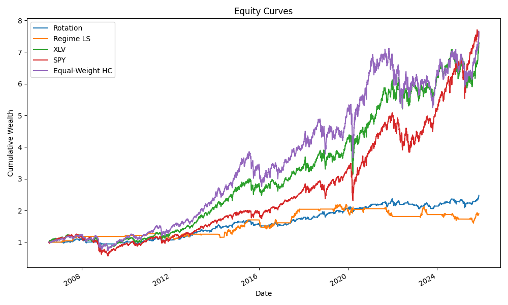

# Healthcare ETF Quant Strategies

Systematic strategies on US healthcare ETFs designed to showcase practical skills in data engineering, quantitative research, and risk analysis

This project implements and evaluates two complementary strategies:

1. **Regime-aware long–short spread between biotech and pharma**  
2. **Momentum-based sector rotation with volatility targeting inside healthcare**

The codebase is structured like a small internal research repo rather than a one-off notebook.

---

## 1. Project Motivation

Healthcare is a core sector for many equity long–short and multi-sector pods, with subsectors that behave very differently:

- **Biotech** is capital intensive, R&D-driven, and highly sensitive to risk appetite and funding conditions.  
- **Pharma, providers, and devices** are more cash-flow stable, but exposed to regulation, reimbursement, and demographic demand.

This repo asks a simple question:

> Can we use **macro regimes** and **cross-sectional momentum** to time relative performance within healthcare, while respecting realistic portfolio and risk constraints?

The goal is not to produce a production-ready strategy, but to demonstrate:

- End-to-end handling of real market and macro data  
- Clean implementation of backtests with explicit assumptions  
- Use of risk and factor analytics to understand what a strategy is actually doing  
- Clear communication of results to a portfolio manager or data-focused stakeholder

---

## 2. Strategy Overview

### 2.1 Regime Long–Short: Biotech vs Pharma

**Instruments**

- **Long leg:** XBI – SPDR S&P Biotech ETF  
- **Short leg:** XPH – SPDR S&P Pharmaceuticals ETF  
- Benchmarks:  
  - XLV – Health Care Select Sector SPDR  
  - SPY – SPDR S&P 500 ETF

**Idea**

Use macro signals to classify **risk-on** vs **risk-off** environments:
- Change in 10-year Treasury yield (funding conditions)  
- Equity trend (SPY 6-month return)  
- VIX level (risk sentiment)

In risk-on regimes, tilt toward **R&D-heavy biotech** by going long XBI and short XPH.  
In risk-off regimes, tilt toward **defensive pharma** by reducing or reversing the spread.

**Demonstrates**

- Translating healthcare intuition (funding cycles matter for biotech) into explicit, testable rules  
- Building a long–short portfolio and understanding gross vs net exposure  
- Evaluating strategies on both absolute returns and **sector relative value**

---

### 2.2 Momentum Rotation With Volatility Targeting

**Universe**

- XLV – Broad US healthcare  
- XBI – Biotech  
- XPH – Pharma  
- IHF – Healthcare providers and services  
- IHI – Medical devices

**Idea**

- Monthly:
  - Compute **6–12 month momentum**
  - Rank ETFs by momentum
  - Select the top K subsectors
  - Estimate realized volatility per ETF
  - Allocate using an **inverse volatility rule** so risk is balanced across positions
- Optionally move to cash when all subsectors show negative momentum

**Demonstrates**

- Cross-sectional signal construction inside a single sector  
- Simple volatility targeting and risk budgeting  
- Comparison against:
  - Buy-and-hold XLV  
  - Equal-weighted healthcare basket

---

## 3. What This Project Signals to a Hedge Fund Team

This project highlights skills relevant for a **data associate** or **junior quant** role:

### **Data & Research Engineering**
- Reusable ETF and macro loaders
- Clear separation of data, signals, backtest, and analysis modules
- Config-driven design for reproducibility and parameter control

### **Backtesting Literacy**
- Explicit rebalance schedule and no–lookahead design  
- Turnover and transaction cost modeling  
- Support for long-only and long–short portfolios

### **Risk & Factor Awareness**
- Standard metrics: CAGR, volatility, Sharpe, max drawdown  
- Factor regressions vs market, size, value, etc.  
- Interpretation of exposures (e.g., does a strategy simply load on small-cap factor?)

### **Healthcare-Specific Understanding**
- Why biotech reacts more strongly to low-rate, high-liquidity regimes  
- Why pharma outperforms in defensive or high-volatility markets  
- How capital rotates between innovation, devices, and service providers

### **Communication**
- Notebooks designed for PM readability  
- Clean charts and summary tables  
- Clear articulation of assumptions and limitations

---

## 4. Project Structure

```

.
├── data_raw/          # Raw downloaded CSVs (never edited)
├── data_processed/    # Cleaned, aligned time series
├── src/
│   ├── config.py
│   ├── data/
│   ├── signals/
│   ├── backtest/
│   ├── analysis/
│   ├── plots/
├── notebooks/
│   ├── 01_data_sanity.ipynb
│   ├── 02_regime_ls_demo.ipynb
│   ├── 03_rotation_demo.ipynb
│   ├── 04_risk_and_factors.ipynb
├── config/
│   ├── settings.yaml
├── tests/
├── requirements.txt
└── README.md

````

This is intentionally structured like an internal research codebase, not a one-off notebook.

---

## 5. Data Sources & Assumptions

### Prices  
- Downloaded from Yahoo Finance via `yfinance`  
- Adjusted close used to reflect dividends & corporate actions

### Macro  
- 10-year Treasury yield (funding environment)  
- VIX (risk sentiment)  
- SPY trend (equity regime proxy)

### Factors  
- Fama–French data from the Kenneth French data library  

### Backtest Window  
- Default start: **2007-01-01**  
- End: latest available data

### Transaction Costs  
- Default: **10 bps** per round-trip turnover  
- Imposed to avoid unrealistic performance

This project is **educational** and not investment advice.

---

## 6. Quickstart

### 6.1 Environment Setup

```bash
python3 -m venv .venv
source .venv/bin/activate     # Windows: .venv\Scripts\activate

pip install --upgrade pip
pip install -r requirements.txt
````

### 6.2 Configure Tickers & Dates (Optional)

Edit:

* `config/settings.yaml`
* `src/config.py`

### 6.3 Download Data

Data downloads are handled programmatically—no manual steps required:

- **ETFs:** `src/data/etf_loader.load_clean_prices()` calls `yfinance.download`, caches raw prices to `data_raw/etf_prices_raw.csv`, cleans/ffills, and writes `data_processed/etf_prices_clean.csv`.
- **Quick refresh:** run `python run_strategies.py` or open `notebooks/01_data_sanity.ipynb`; both trigger the ETF download/cache if files are missing.
- **Macro/FF factors:** placeholders are wired; drop processed macro/factor CSVs into `data_processed/` (e.g., `ff_factors_monthly.csv`) when available.

If you need to force a redownload, delete the cached CSVs in `data_raw/` and `data_processed/` and rerun the script/notebook.

### 6.4 Reproduce Results Snapshot

```bash
python results/make_results.py          # regenerate CSV + plots in results/
python run_strategies.py --tc_bps 10    # print metrics; add --split_year 2015 for train/test
```

Artifacts:
- `results/strategy_summary.csv`
- `results/equity_curves.png`
- `results/metrics_bar.png`
- `results/results.ipynb` (renders summary + plots)

Current headline numbers (10 bps costs, full sample):
- Rotation: CAGR ~4.8%, Sharpe ~0.62
- Regime LS: CAGR ~3.3%, Sharpe ~0.38
- Benchmarks: XLV Sharpe ~0.69, SPY ~0.63, equal-weight HC ~0.63



to change:

* ETF universe
* Start/end dates
* Strategy parameters
* Transaction costs

### 6.3 Run Notebooks

```bash
jupyter notebook notebooks/
```

Recommended order:

1. `01_data_sanity.ipynb`
2. `02_regime_ls_demo.ipynb`
3. `03_rotation_demo.ipynb`
4. `04_risk_and_factors.ipynb`

### 6.4 Optional Driver Script

If `run_strategies.py` is present:

```bash
python run_strategies.py
```

This runs both strategies end-to-end and prints summary metrics.

---

## 7. Limitations & Extensions

**Simplifications**

* ETF-only universe
* Fixed monthly rebalancing
* Simple volatility targeting
* Simple transaction cost model

**Potential Extensions**

* Adding single-stock healthcare universes
* More robust risk-parity and drawdown controls
* Incorporating credit spreads or liquidity indicators
* More systematic signal combination (momentum + valuation + quality)
